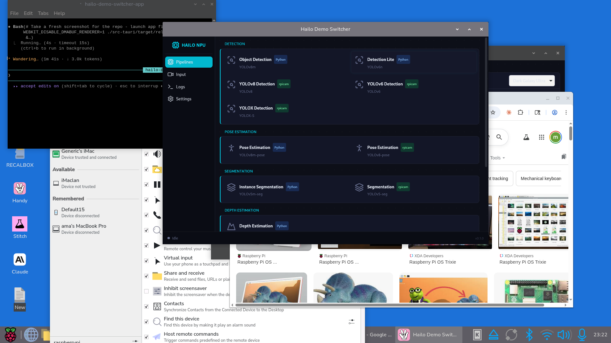

# Hailo Demo Switcher

A desktop GUI for browsing and launching Hailo NPU AI demo pipelines on Raspberry Pi 5. Built with Tauri 2.x, React, and TypeScript.



## Quick Start

```bash
git clone https://github.com/aarzamen/hailo-switcher.git
cd hailo-switcher
bun install
bun run tauri dev
```

> **Note**: This was built for a specific Pi 5 + Hailo-8 setup. Paths default to `/home/ama/hailo/hailo-rpi5-examples/` but can be overridden via environment variables — see `.env.example`.

## Features

- **13 AI pipelines** across 6 categories: Detection, Pose Estimation, Segmentation, Depth Estimation, Classification, and Face Detection
- **Unified video source picker**: Auto-detects USB cameras, Pi Camera Module, screen capture (X11/Wayland), demo video, and custom video files — any source works with any pipeline
- **Screen region capture**: Full screen or custom region selection with presets (Left Half, Right Half, etc.)
- **Live log streaming** from pipeline stdout/stderr with FPS extraction
- **Process management**: Start, stop, and switch between pipelines with automatic NPU resource cleanup (2s cooldown)
- **Dark Galaxy Ultra theme**: Sci-fi command console UI with cyan accents and dot-grid starfield background
- **Playwright-verified UI**: Every interactive element tested for ARM64 WebKitGTK compatibility

## Supported Pipelines

### Python-based (GStreamer + Hailo NPU)

| Pipeline | Model | Description |
|----------|-------|-------------|
| Object Detection | YOLOv8m | 80-class real-time object detection |
| Detection Lite | YOLOv6n | Lightweight, lower CPU usage |
| Pose Estimation | YOLOv8m-pose | 17-point human body keypoints |
| Instance Segmentation | YOLOv5m-seg | Pixel-level object masks |
| Depth Estimation | SCDepthV3 | Monocular depth mapping |

### rpicam-apps (require Pi Camera Module)

| Pipeline | Model | Description |
|----------|-------|-------------|
| YOLOv8 Detection | YOLOv8 | rpicam-apps object detection |
| YOLOv6 Detection | YOLOv6 | rpicam-apps detection |
| Person + Face | YOLOv5 | Person and face detection |
| YOLOX Detection | YOLOX-S | Lightweight detection |
| Segmentation | YOLOv5-seg | Colour mask segmentation |
| Pose Estimation | YOLOv8-pose | 17-point pose estimation |
| Classification | ResNet50 | Image classification |
| Face Detection | SCRFD | Face detection |

## Video Sources

The app auto-detects all available video sources on startup:

| Source | Detection Method | Notes |
|--------|-----------------|-------|
| USB Cameras | `v4l2-ctl --list-devices` | Shows device name, filters non-camera devices |
| Pi Camera | `rpicam-hello --list-cameras` | CSI-connected camera modules |
| Network Camera | v4l2loopback `/dev/video10` | Remote RPi camera over ethernet (see below) |
| RTSP Stream | User-provided URL | `rtsp://` URLs via `rtspsrc` GStreamer element |
| YouTube Stream | User-provided URL | Resolved via `yt-dlp` to direct stream |
| Full Screen | Always available | X11 (`ximagesrc`) or Wayland (`pipewiresrc`) |
| Screen Region | Always available | Custom x/y/width/height or presets |
| Demo Video | Always available | Built-in `example.mp4` from hailo-rpi5-examples |
| Video File | Always available | User picks `.mp4`, `.avi`, `.mkv`, `.mov`, `.webm` |

All sources resolve to a GStreamer source element via the `VideoSource` enum in the Rust backend.

### Network Camera (Remote RPi)

If your camera is connected to a different Raspberry Pi (e.g., Camera Module 3 on an RPi4), you can stream it over ethernet to this Pi for Hailo inference.

**On this Pi (RPi5 receiver):**
```bash
# Start the network camera receiver (creates /dev/video10 via v4l2loopback)
./scripts/network-camera.sh start
```

**On the remote Pi (RPi4 sender):**
```bash
rpicam-vid -t 0 --width 1280 --height 720 --framerate 30 \
  --codec h264 --inline --bitrate 4000000 -o - | \
  gst-launch-1.0 fdsrc ! h264parse ! rtph264pay config-interval=1 pt=96 ! \
  udpsink host=<RPi5_IP> port=5000 sync=false
```

The network camera appears automatically in the source picker as a regular device. Expected latency: ~150-250ms over ethernet.

**Alternative — RTSP via MediaMTX:**
Run [MediaMTX](https://github.com/bluenviron/mediamtx) on the RPi4 with `rpiCamera` source, then use the Stream source in the UI with `rtsp://<RPi4_IP>:8554/cam`. Requires the RTSP patch (included in `patches/hailo-rtsp-support.patch`).

## Prerequisites

### Hardware

- Raspberry Pi 5 (8GB recommended)
- Hailo-8 (26 TOPS) or Hailo-8L (13 TOPS) AI HAT/Kit
- USB webcam (optional, for live camera input)
- Pi Camera Module (optional, for rpicam-apps pipelines)

### Software

- Raspberry Pi OS (Bookworm/Trixie, 64-bit)
- Hailo runtime and TAPPAS packages installed:
  ```
  sudo apt install hailo-all
  ```
- [hailo-rpi5-examples](https://github.com/hailo-ai/hailo-rpi5-examples) installed with its Python venv (default path: `/home/ama/hailo/hailo-rpi5-examples/`, override with `HAILO_EXAMPLES_DIR` env var)
- Post-process shared library symlinks (see [Setup](#post-process-libraries))

### Build Tools

- [Bun](https://bun.sh/) (or npm/yarn)
- Rust toolchain (rustup)
- Tauri 2.x CLI: `bun add -D @tauri-apps/cli`
- System libraries for Tauri on Linux:
  ```
  sudo apt install libwebkit2gtk-4.1-dev libgtk-3-dev libayatana-appindicator3-dev
  ```

## Setup

### Install Dependencies

```bash
git clone https://github.com/aarzamen/hailo-switcher.git
cd hailo-switcher
bun install
```

### Post-process Libraries

The hailo-rpi5-examples pipelines expect post-process `.so` files in `/usr/local/hailo/resources/so/`. Create symlinks from the system TAPPAS libraries:

```bash
TAPPAS_DIR="/usr/lib/aarch64-linux-gnu/hailo/tappas/post_processes"
SO_DIR="/usr/local/hailo/resources/so"
mkdir -p "$SO_DIR"

ln -sf "$TAPPAS_DIR/libyolo_hailortpp_post.so" "$SO_DIR/libyolo_hailortpp_postprocess.so"
ln -sf "$TAPPAS_DIR/libyolov8pose_post.so" "$SO_DIR/libyolov8pose_postprocess.so"
ln -sf "$TAPPAS_DIR/libyolov5seg_post.so" "$SO_DIR/libyolov5seg_postprocess.so"
ln -sf "$TAPPAS_DIR/libdepth_estimation.so" "$SO_DIR/libdepth_postprocess.so"
ln -sf "$TAPPAS_DIR/libclassification.so" "$SO_DIR/libclassification_postprocess.so"
ln -sf "$TAPPAS_DIR/libscrfd_post.so" "$SO_DIR/libscrfd.so"

# Link all remaining TAPPAS libs
for so in "$TAPPAS_DIR"/*.so; do
    name=$(basename "$so")
    [ ! -e "$SO_DIR/$name" ] && ln -sf "$so" "$SO_DIR/$name"
done
```

### Verify Hailo Hardware

```bash
hailortcli fw-control identify
```

## Development

```bash
bun run tauri dev
```

This starts the Vite dev server with hot reload and compiles the Rust backend in debug mode.

### Testing

```bash
# Button audit — verifies every clickable element responds to Playwright clicks
bunx tsx tests/button-audit.ts

# Visual verification — screenshot walkthrough of all UI features
bun run verify
```

## Build

```bash
bun run tauri build
```

Produces:
- Binary: `src-tauri/target/release/hailo-switcher`
- Debian package: `src-tauri/target/release/bundle/deb/Hailo Switcher_0.1.0_arm64.deb`

Build takes ~10 minutes on Pi 5 (release profile with optimizations).

## Run

```bash
WEBKIT_DISABLE_DMABUF_RENDERER=1 ./src-tauri/target/release/hailo-switcher
```

Or install the `.deb`:

```bash
sudo dpkg -i "src-tauri/target/release/bundle/deb/Hailo Switcher_0.1.0_arm64.deb"
```

> **Note**: `WEBKIT_DISABLE_DMABUF_RENDERER=1` is needed on some Pi 5 configurations to avoid WebKitGTK rendering issues.

## Architecture

```
hailo-switcher/
├── src/                          # React + TypeScript frontend
│   ├── App.tsx                   # Main layout (sidebar + content + footer)
│   ├── themes/                   # CSS theme system (Dark Galaxy Ultra)
│   ├── stores/
│   │   ├── pipelineStore.ts      # Pipeline state, source selection, IPC
│   │   └── captureStore.ts       # Screenshot/recording state
│   ├── types/pipeline.ts         # VideoSource, AvailableSource, etc.
│   ├── data/pipelines.ts         # Pipeline definitions (13 entries)
│   └── components/
│       ├── Sidebar.tsx           # Config-driven navigation
│       ├── pipelines/            # Pipeline grid, cards, detail panel
│       ├── input/
│       │   ├── InputSourceSelector.tsx  # Unified source picker
│       │   └── ScreenRegionSelector.tsx # Screen capture region config
│       ├── logs/                 # Live log viewer
│       ├── settings/             # Theme selector, Hailo status
│       └── footer/               # Status bar, capture, run/stop
├── src-tauri/                    # Rust backend
│   └── src/
│       ├── lib.rs                # Tauri app setup, command registration
│       ├── config.rs             # Env-var-based path configuration
│       ├── video_sources.rs      # VideoSource enum, GStreamer resolution
│       ├── process_manager.rs    # Async process spawn/stream/kill
│       └── commands/
│           ├── pipeline.rs       # start/stop/status commands
│           ├── system.rs         # detect_sources, device/hailo detection
│           └── capture.rs        # screenshot, recording commands
└── tests/
    ├── button-audit.ts           # Playwright click-test of all UI elements
    └── visual-verify.ts          # Screenshot verification walkthrough
```

### Frontend-Backend Communication

- **Tauri commands** (frontend -> backend): `invoke("start_pipeline", ...)`, `invoke("stop_pipeline")`, `invoke("detect_sources")`, `invoke("list_video_devices")`
- **Tauri events** (backend -> frontend): `pipeline-log` (stdout/stderr lines), `pipeline-status` (idle/running/error)

### Video Source Resolution

Every video source resolves to a single thing: a GStreamer source description or a device path.

```
User selects source → VideoSource enum → to_input_arg() → --input flag → Python/rpicam pipeline
```

The `VideoSource` enum (`Device`, `File`, `Screen`, `Demo`) handles all source types uniformly. The frontend doesn't need to know about GStreamer plumbing.

### Process Management

- Pipelines run as child processes in their own process group
- Stop sends SIGTERM, then SIGKILL after 1 second
- Starting a new pipeline auto-stops the current one with a 2-second cooldown for NPU resource release
- Environment variables (`PYTHONPATH`, `HAILO_ENV_FILE`, `LD_LIBRARY_PATH`) are set automatically

## Tech Stack

- **Tauri 2.x** - Desktop framework (Rust + WebView)
- **React 18** - UI components
- **TypeScript** - Type safety
- **Tailwind CSS 4** - Styling with CSS variable theming
- **Zustand** - State management
- **Vite** - Frontend bundler
- **Tokio** - Async Rust runtime for process management
- **Playwright** - UI testing and verification

## Theme System

The app includes a swappable CSS theme system:
- **Dark Galaxy Ultra** (default): Sci-fi command console with cyan accents, dot-grid starfield background
- **Default**: Light/dark theme with soft pink accents

Themes are pure CSS variable overrides, switchable from Settings.

## License

MIT
